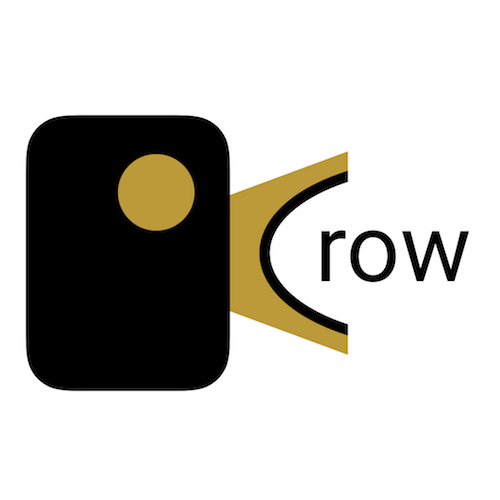

# Crow



### Crow is a web app for thoughtful tweeting

Twitter's ease of use is much of what makes it so great, but that low barrier to posting also makes it really easy to make typos, or make regrettable posts. Crow is here to help.

Crow allows you to jot down thoughts as you think of them, and come back to them later for pruning, and post them to Twitter when you're ready.

## Getting Started

### Installing

First, clone Crow to your local machine, and move into that directory.

```shell
git clone https://github.com/hisaac/crow.git && cd crow
```

You will need to setup your Mongo database to include the required `crow` database and `users` collection. After starting the Mongo shell, use these commands:

```shell
use crow
db.createCollection("users")
```

Then update NPM, install the required dependencies, and start the server.

```shell
npm update
npm install
node server/app.js
```

Once installed and started, the site will be live on `http://localhost:3000`.

### Meta

Crow was heavily inspired by the late [Birdhouse](http://birdhouseapp.com) for iOS. I'm not alone in my desire for a similar tool for Twitter, and my hope is that this will fill the whole left by Birdhouse.

Crow was/is being developed as my solo project during my time as a student at [Prime Digital Academy](http://primeacademy.io).

You can follow along with my experiences as I progress through development on my blog, [hisaac.blog](http://hisaac.blog). I'll be posting at least every weekday about what I did and learned that day.

If you need support when using the app, feel free to contact me at <mailto:hello@hisaac.net>, or visit Crow's website (forthcoming).

### Software/Tools/Code used for this project

- [Node.js](https://nodejs.org/en/)
- [AngularJS](https://angularjs.org)
- [Normalize.css](https://necolas.github.io/normalize.css/)
- [FastClick](https://github.com/ftlabs/fastclick)
- [Bootstrap](http://getbootstrap.com)
- [Skeleton](http://getskeleton.com)
- [Atom](https://atom.io)
- [Visual Studio Code](https://code.visualstudio.com)
- [Sublime Text](https://www.sublimetext.com)
- [WebStorm](https://www.jetbrains.com/webstorm/)
- [Keynote](http://www.apple.com/keynote/)
- [Firebase](https://firebase.google.com)
- [Paw](https://paw.cloud)
- [Textastic](https://www.textasticapp.com/iphone.html)
- [Working Copy](https://workingcopyapp.com)
- [MongoDB](https://www.mongodb.com)
- [Mongoose](http://mongoosejs.com)
- [MongoChef](http://3t.io/mongochef/)
- [GitHub](http://github.com)
- [Trello](https://trello.com)
- [Slack](https://slack.com)
- [Dash](https://kapeli.com/dash)
- [dotenv](https://github.com/motdotla/dotenv)
- [Express](http://expressjs.com)

## License

This project is licensed under the MIT License - see the [LICENSE.txt](./LICENSE.md) file for details
